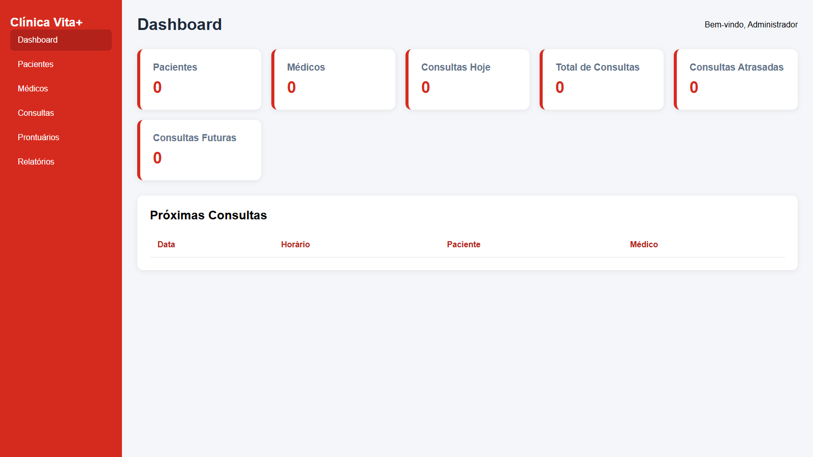
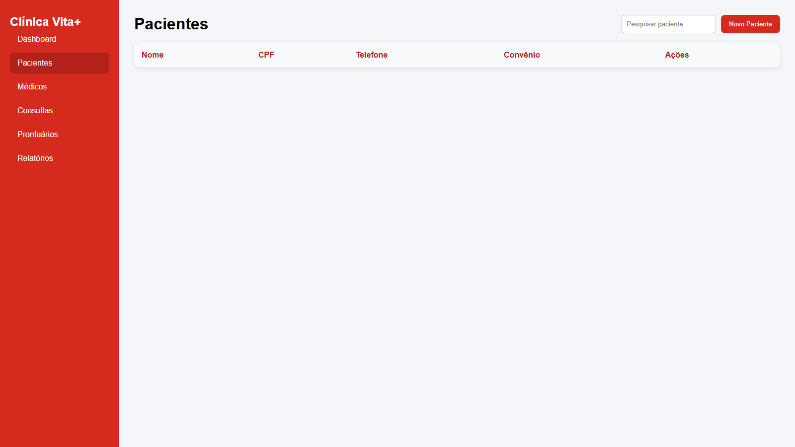
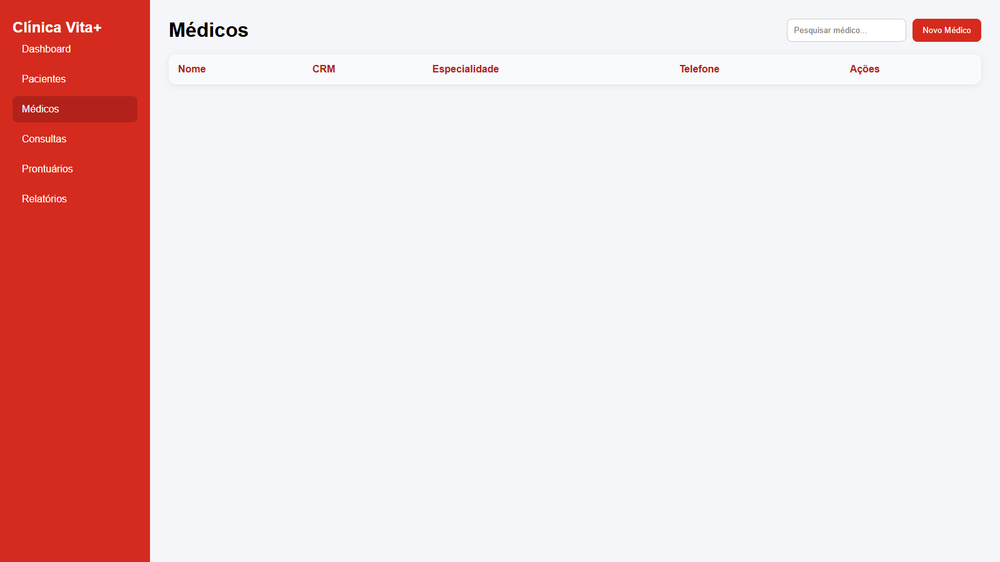
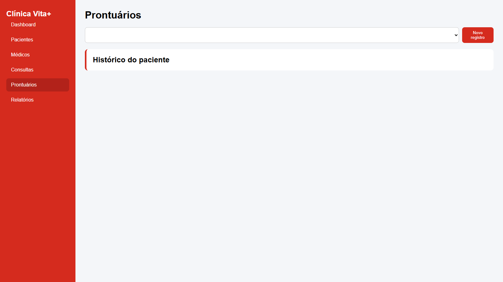
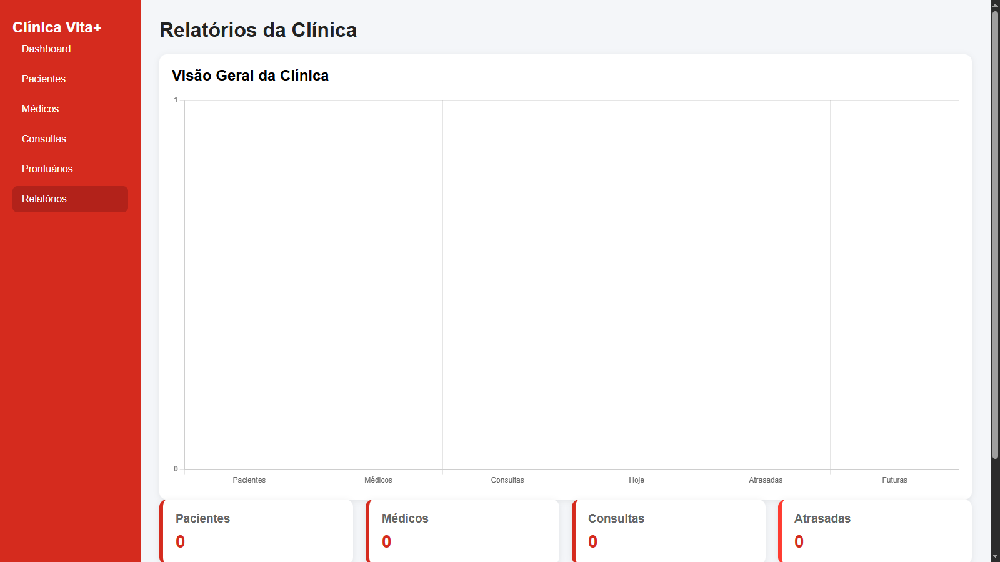

# 🏥 Clínica Vita+ - Sistema de Gestão Clínica

Sistema web de gerenciamento clínico desenvolvido com **HTML, CSS e JavaScript puro**, utilizando **localStorage** para persistência de dados.

O projeto simula o funcionamento de uma clínica médica real, com cadastro de pacientes, médicos, consultas, prontuários e dashboard com indicadores em tempo real.

---

## 🚀 Funcionalidades

- Cadastro de pacientes
- Cadastro de médicos
- Agendamento de consultas
- Status automático (agendada / atrasada)
- Prontuário por paciente
- Histórico clínico completo
- Dashboard com métricas dinâmicas
- Relatórios com gráficos
- Busca em tempo real
- Edição e exclusão de registros
- Persistência de dados com localStorage

---

## 🧠 Tecnologias utilizadas

- HTML5
- CSS3
- JavaScript (Vanilla)
- localStorage
- Chart.js

---

## 📊 Dashboard

Visão geral do sistema com dados atualizados automaticamente:

- Total de pacientes
- Total de médicos
- Consultas do dia
- Consultas atrasadas
- Próximas consultas



---

## 👨‍⚕️ Pacientes

Gerenciamento completo de pacientes:

- Cadastro
- Edição
- Exclusão
- Pesquisa em tempo real



---

## 🩺 Médicos

Controle de médicos cadastrados:

- Nome
- CRM
- Especialidade
- Contato



---

## 📅 Consultas

Sistema de agendamento completo:

- Seleção de paciente e médico
- Data e horário
- Status automático
- Histórico de consultas


---

## 📁 Prontuários

Histórico médico por paciente:

- Diagnóstico
- Observações
- Médico responsável
- Data de atendimento



---

## 📈 Relatórios

Gráficos automáticos com dados do sistema:

- Distribuição de consultas
- Volume de atendimentos
- Indicadores gerais da clínica



---

## ⚙️ Como executar

Clone o repositório:

```bash
git clone https://github.com/Richter06/clinica